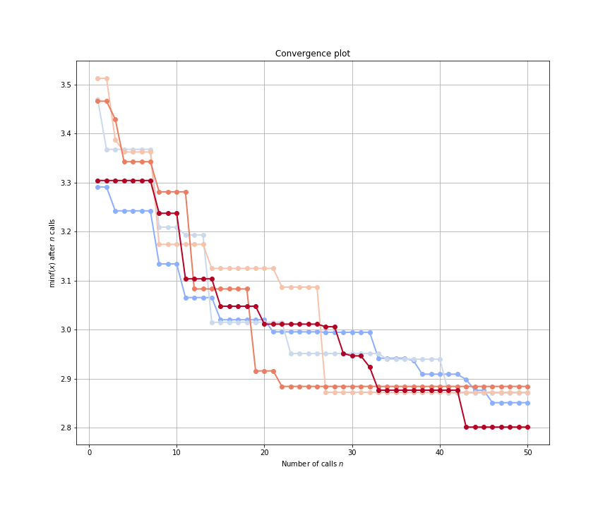
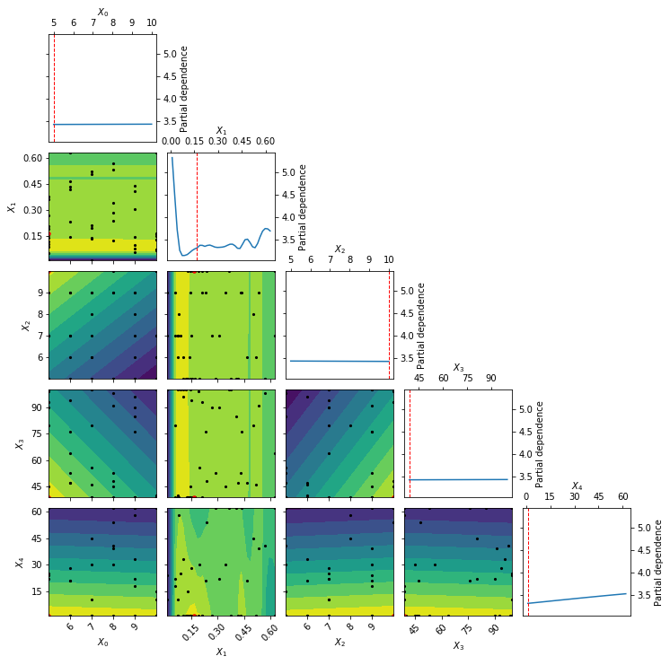

===============
Viewing Results
===============

Once we have run HypeSpace, we can then check in to see how the 
optimization performed. If you recall from previous tutorials,
we specified a `results_path` within the `hyperdrive` function.
This specified the path where we saved the results from the 
distributed run. Loading those results is as simple as

.. code-block:: python

    from my_optimization import objective
    from hyperspace.kepler.data_utils import load_results

    path = '/results_path'
    results = load_results(path, sort=True)

Pointing `load_results` to the directory that we saved the
HyperSpace results to returns a list of `Scipy.OptimizeResults`
objects. By setting `sort=True`, we sort the results by the
minimum found in ascending order. 
Note that we have imported the `objective` function
here. This is because the Python pickles the reference to that 
namespace whenever it saves `Scipy.OptimizeResults` objects.
Each element of this list of results contains all of the information
gained through the optimization process for the respective
distributed ranks. This includes the following:

1. `fun`: the minimum found by the optimization
2. `func_vals`: the function value found at each iteration of the optimization
3. `models`: the specification of the surrogate model at each iteration
4. `random_state`: the random seed
5. `space`: the bounds of the search space for that particular rank
6. `specs`: the specification for the Bayesian SMBO
7. `x`: point found in the domain that returns the minimal `fun` value
8. `x_iters`: the point in domain sampled at each iteration of the optimization

We can then visualize the course of the optimization with the following:

.. code-block:: python

    from hyperspace.kepler.plots import plot_convergence

    best_result = results.pop(0)

    _ = plot_convergence(results, best_result)

.. image:: _static/img/gbm32.png 
   :width: 600
   :align: center

The above figure shows the convergence plot when optimizing five 
hyperparameters of our regression model from our Gradient Boosted
Trees example. The traces show the optimization progress at each
rank as we run 50 iterations of Bayesian SMBO in parallel. The red
trace shows the best performing rank.

Note that the `plot_convergence` function can accept a list of HyperSpace
results (`results` in this case), and it can accept a single rank's result
(`best_results` here). If we had many traces from a large scale run, it can 
sometimes be helpful to look at only a few of the traces at a time. Here is
how we can look at the top five results from the above HyperSpace run:

.. code-block:: python

   _ = plot_convergence(results[0], results[1], results[2], results[3], best_result) 

By examining the optimization traces, we could then decide to prune some of the
search spaces in the future. Since machine learning is always an iterative 
process, understanding the behavior of our models over various hyperparameter
search spaces can inform future model building. 

We can also explore the effects of the hyperparameters within each of the search
spaces. Since Scikit-Optimize :cite:`tim_head_2018_1207017` is integrated into HyperSpace, 
we can then explore the partial dependencies between hyperparameters. Originally 
proposed by Jerome H. Friedman, partial dependence plots were designed to visualize
the effects of input variables for gradient boosted machines :cite:`friedman2001`.
Here we can use them to understand the partial dependence of our objective function
on each of the hyperparameters, holding all others constant, as well as all two-way
interactions between hyperparameters, again holding all others constant.

.. code-block:: python

    from skopt.plots import plot_objective

    _ = plot_objective(best_result)

The above partial dependence plot shows how our objective function behaves at 
various settings of our model hyperparameters when considering the best 
hyperparameter subspace found by HyperSpace.
Along the diagonal we have the effect of each hyperparameter, holding all other
hyperparameters constant, on the five fold cross validation loss for our 
gradient boosted regressor. The dotted red line each of those subplots indicates
the final setting of the hyperparameter. All off-diagonal plots show the two-way
interactions for the hyperparameters, holding all other hyperparameters constant. 
The black points within these subplots show the points sampled along the two 
search dimensions. The red point in each of those subplots shows the final setting 
for the hyperparameters. The countours on the two-way interactions subplots show
the loss landscape as viewed by our surrogate Gaussian process. Yellow contours
indicate lower regions in the loss, whereas blue regions show higher loss values.

As we iterate through the model building process, it is helpful to visualize the
outcomes of the optimization process. This allows us to inject our preferences and 
intuitions into the process so that we can better steer future directions.

.. rubric:: References

.. bibliography:: refs_results.bib
   :style: plain
   :cited:
