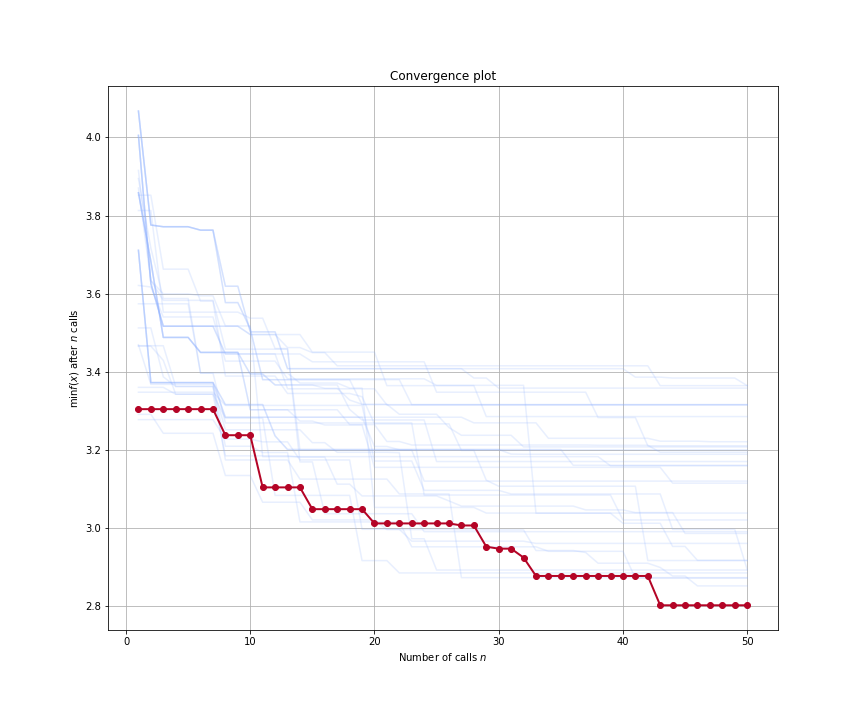

===============
Viewing Results
===============

Once we have run HypeSpace, we can then check in to see how the 
optimization performed. If you recall from previous tutorials,
we specified a `results_path` within the `hyperdrive` function.
This specified the path where we saved the results from the 
distributed run. Loading those results is as simple as

.. code-block: python

    from hyperspace.kepler.data_utils import load_results

    def objective():
        pass

    path = '/results_path'
    results = load_results(path, sort=True)

Pointing `load_results` to the directory that we saved the
HyperSpace results to returns a list of `Scipy.OptimizeResults`
objects. Note that we have initialized an empty `objective` function
here. This is because the Python pickles the reference to that 
namespace whenever it saves `Scipy.OptimizeResults` objects.
Each element of this list of results contains all of the information
gained through the optimization process for the respective
distributed ranks. This includes the following:

1. fun: the minimum found by the optimization
2. func_vals: the function value found at each iteration of the optimization
3. models: the specification of the surrogate model at each iteration
4. random_state: the random seed
5. space: the bounds of the search space for that particular rank
6. specs: the specification for the Bayesian SMBO
7. x: point found in the domain that returns the minimal `fun` value
8. x_iters: the point in domain sampled at each iteration of the optimization

We can then visualize the course of the optimization with the following:

.. code-block: python

    from hyperspace.kepler.plots import plot_convergence

    best_result = results.pop(0)

    _ = plot_convergence(results, best_result)

The above figure shows the convergence plot when optimizing five 
hyperparameters of our regression model from our Gradient Boosted
Trees example.
